# Отчет по работе 1

### Задание 1
* Прагматика - что я хочу получить от программы. 
* Семантика - как это будет работать. 
* Синтаксис - как это записать. 
* Язык низкого уровня - язык, на котором пишут программу, исполняемую непосредственно физическим устройством.
* Исполняемый файл (исполняемый код) — файл, содержащий программу в виде набора элементарных инструкций, которая после загрузки в память может быть выполнена на определенном физическом устройстве (процессоре) под управлением опредленной операционной системы.
* Ассемблер - язык программирования низкого уровня, в котором каждая инструкция физического устройства представлена в текстовом виде.
* Язык высокого уровня - язык, абстрагирующийся от команд процессора: функции, классы, алгоритмы и т.д.
* Исходный код - текст программы, написанный на языке высокого уровня.
* Транслятор - программа, необходимая для перевода исходного кода в исполняемый вид.
* Виртуальная машина - средство описания семантики языка программирования. 
* Стандарт языка программирования - документ, описывающий язык программирования максимально подробно и, по возможности, наиболее формально.
* Транслятор - техническое средство, осуществляющее перевод текста программы с одного языка на другой.
* Компилятор - транслятор, переводящий программу в машинный код для последующего исполнения.
* Интерпретатор - транслятор, читающий и исполняющий программу по одной команде.
* Псевдокомпилятор - транслятор, переводящий программу в промежуточное представление (байт-код), которое затем выполняется на виртуальной машине.
* Байт-код - набор инструкций, близких по смыслу к машинному коду, но исполняемых виртуальной машиной, а не процессором напрямую.
* Компилирующий интерпретатор - транслятор, переводящий текст во внутреннее представление сразу после запуска и тут же его исполняющий.
* REPL-интерпретатор - программа, работающая в цикле «чтение - вычисление - печать» (Read-Eval-Print Loop): считывает конструкцию языка, транслирует, исполняет, печатает результат.
* Единица трансляции - минимальный фрагмент программы, который может быть оттранслирован независимо от остального кода (в C++ - обычно один файл .cpp).
* Препроцессинг (предобработка) - начальный этап трансляции программы.
* Директива #include - формально заменяется на содержимое указанного файла, фактически используется для подключения библиотек и раздельной компиляции.
* Директива #define - задаёт замену имени макроса на его текст.
* Директива #pragma - задаёт параметры трансляции, специфичные для конкретного компилятора.
* Условная трансляция (#ifdef, #ifndef, #else, #endif) - включает или исключает часть кода из трансляции в зависимости от того, определен ли макрос.
* Сборка - заключительный этап трансляции, результатом которого является исполняемый файл.
* Объектный файл - промежуточный файл, получаемый после трансляции одной единицы трансляции, содержит имена идентификаторов, но команды уже переведены на язык исполнителя.

### Задание 2
* ALT+F1 - выбор диска на левой панели
* F7 - создать папку
* SHIFT+F4 - создать файл
* F4 - редактировать файл
* F3 - просмотреть файл
* F5 - копировать
* F6 - переместить/переименовать
* F8 / DELETE - удалить
* INSERT - выделить файл
* TAB - переключение между панелями
* ENTER - открыть папку/файл, выполнить команду
* BACKSPACE - выйти на уровень выше
* ESC - отмена/выход
* F10 - выход из Far Manager

### Задание 3
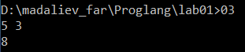

### Задание 4
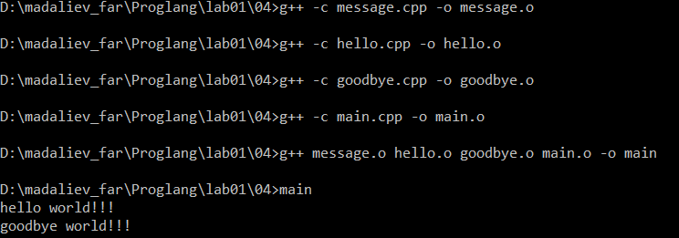
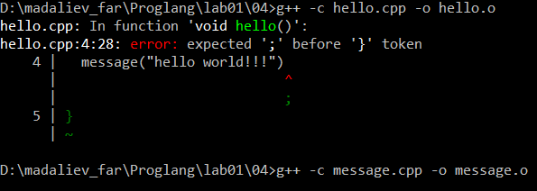
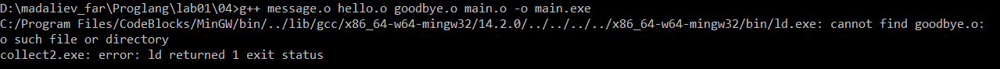

### Задание 5
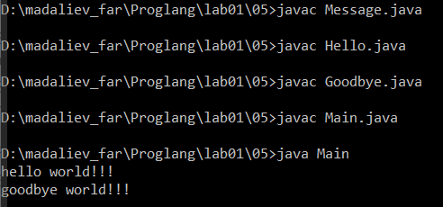
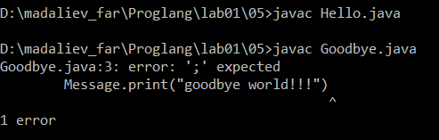
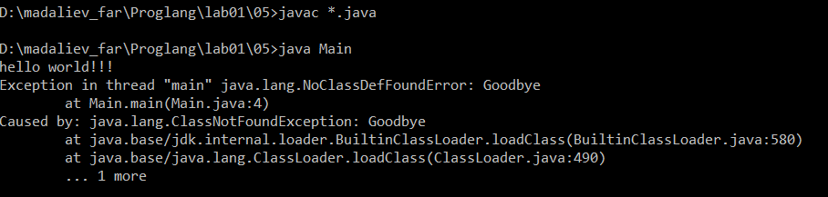

### Задание 6
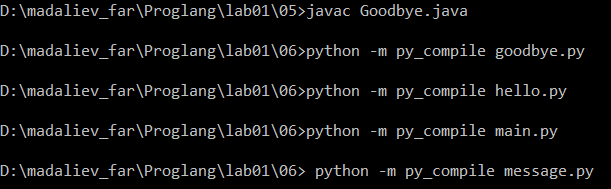
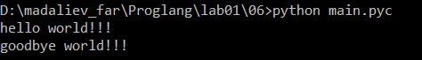
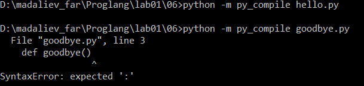
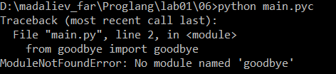

### Задание 7
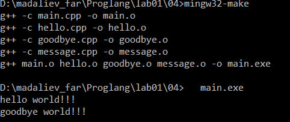
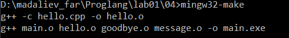
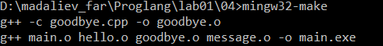

#### Пояснения о работе утилиты `make`:

* Принцип работы: Утилита `make` автоматически управляет сборкой проекта на основе правил из файла `makefile`. Она сравнивает время последнего изменения исходных файлов (`.cpp`) и соответствующих им объектных файлов (`.o`).
* Инкрементальная сборка: Если исходный файл не менялся с момента прошлой сборки, `make` не тратит время на его повторную компиляцию. При изменении конкретного файла (например, `hello.cpp`), утилита перекомпилирует только его, после чего заново пересобирает финальный исполняемый файл. Это колоссально экономит время на больших проектах.
* Восстановление при потере: Если из папки случайно удаляется промежуточный объектный файл (`.o`) или сам исполняемый файл (`.exe`), утилита автоматически обнаруживает пропажу зависимости и точечно запускает только те команды компиляции, которые необходимы для восстановления утерянного элемента.

### Задание 8
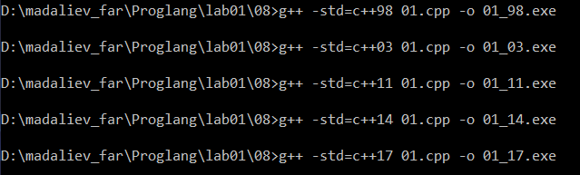
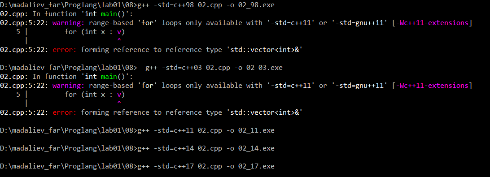
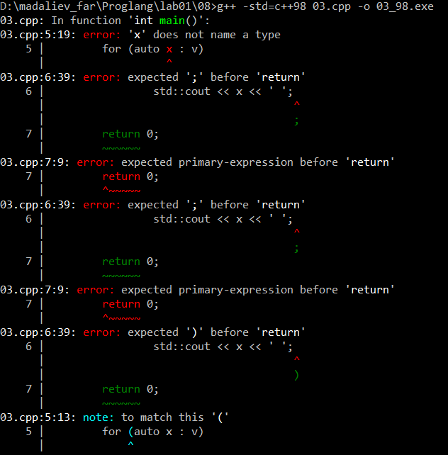(08_3_2.png)
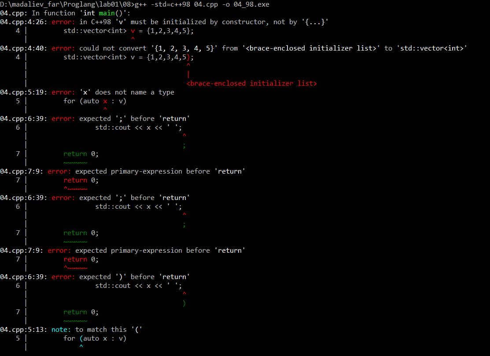(08_4_2.png)
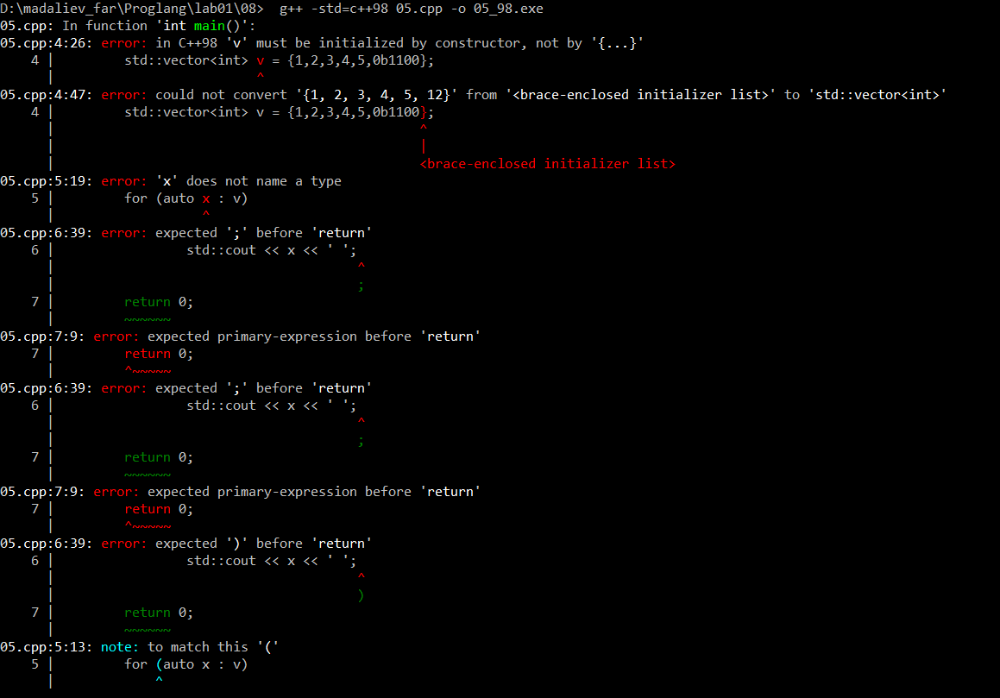(08_5_2.png)
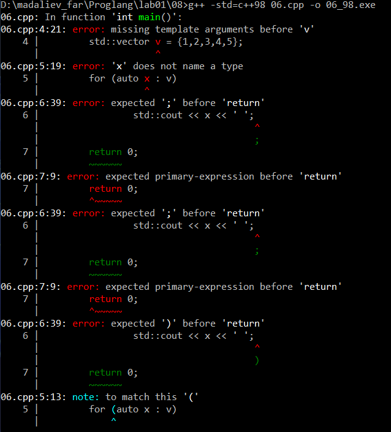(08_6_2.png)(08_6_3.png)

### Задание 9
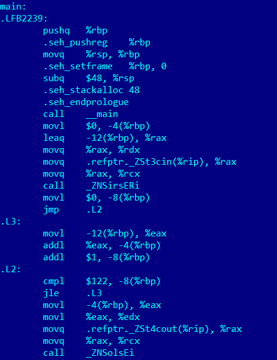
* Код содержит полноценное тело цикла с метками .L2 и .L3. Все переменные (x, s, i) принудительно хранятся в медленной оперативной памяти (стеке). На каждом шаге цикла процессор совершает избыточные операции чтения-записи (movl), что существенно замедляет работу программы.

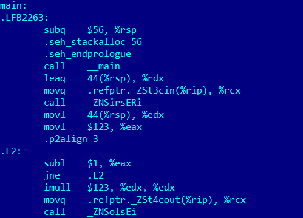
* Происходит качественное изменение логики - компилятор применил технику сворачивания цикла (loop elimination). Он понял, что прибавление числа x само к себе 123 раза математически эквивалентно операции x * 123. Все операции перенесены в быстрые регистры, а само сложение заменено одной инструкцией знакового умножения imull.

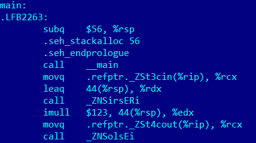
* Код функции main сократился до абсолютного минимума. Компилятор полностью удалил пустой «холостой» цикл, который оставался на уровне -O1. Команда imull напрямую берёт введённое пользователем число из ячейки памяти 44(%rsp), за один такт умножает его на 123 и сразу отправляет результат в регистр %edx для вывода через std::cout.

