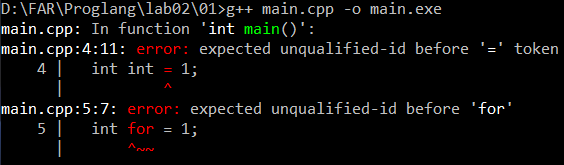
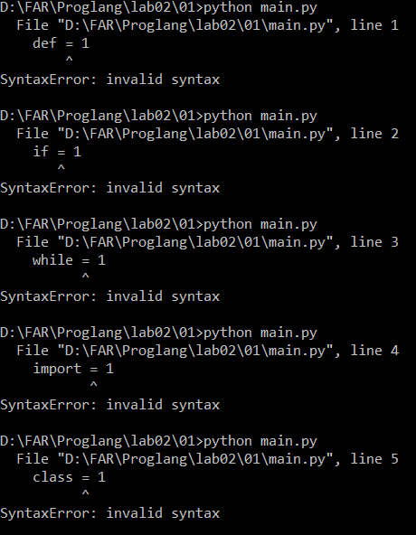
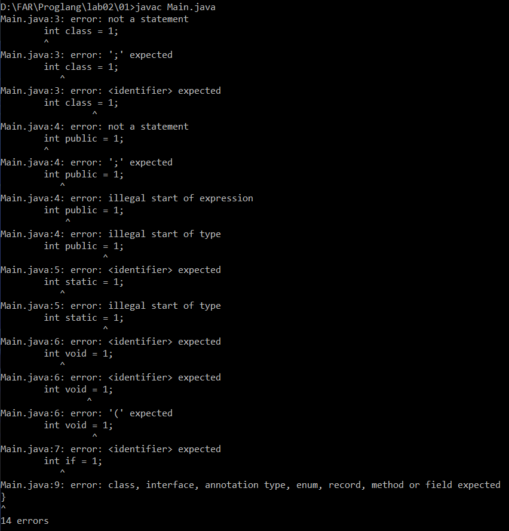
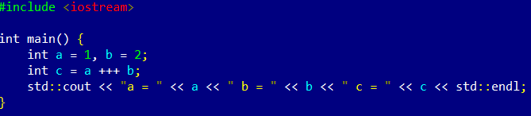
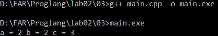
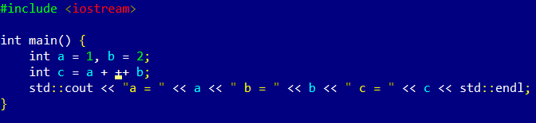
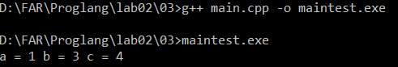
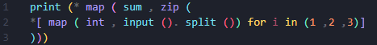

# Отчет по работе 2

### Задание 1
* На С++ создаю переменные с именами int, for, cin, std, unclude.

* Переменные int и for нельзя создать.

* На Python создаю переменные с именами def, if, while, import, class

* Переменные def, if, while, import и class нельзя создать.

* На Java создаю переменные class, public, static, void, if.

* Переменные class, public, static, void и if нельзя создать.

### Задание 2
* Последовательность токенов C++: int a = 1 , b = 2 ; int c = a ++ b ;
* В C++ программа содержит синтаксическую ошибку, потому что ++ является унарным оператором инкремента. Компилятор пытается прочитать выражение a ++ b как a++ b, то есть сначала выполнить инкремент переменной a, а затем встретить b, что недопустимо.

* Последовательность токенов Python: a = 1 b = 2 c = a + + b
* В Python программа не содержит ошибки, потому что там нет оператора ++. Два знака + разбиваются на два отдельных токена: бинарный оператор сложения + и унарный плюс +. Выражение читается как c = a + (+b), что синтаксически верно и даёт результат c = 1 + 2 = 3.

### Задание 3
* Программа на С++:

* Результат программы:

* В первом случае выражение a +++ b разбивается на токены как a ++ + b. Сначала выполняется постфиксный инкремент a++ (a увеличивается на 1, но в выражение подставляется старое значение 1). Затем результат складывается с b. Итог: c = 1 + 2 = 3. Значения: a = 2, b = 2, c = 3.

* Программа на С++ (с пробелом):

* Результат программы:

* Во втором случае выражение a + ++b разбивается иначе: a + ++ b. Сначала выполняется префиксный инкремент ++b (b сразу увеличивается на 1 и становится равным 3). Затем a (равное 1) складывается с новым значением b. Итог: c = 1 + 3 = 4. Значения: a = 1, b = 3, c = 4.

### Задание 4
* Круглые скобки являются оператором вызова функции. Они стоят после имени функции и содержат список аргументов.
* Пример, где круглые скобки – оператор: print("Hello") – здесь () вызывают функцию print.
* Пример, где круглые скобки – не оператор: (a + b) * c – здесь () задают порядок действий (группировка), но не вызывают функцию.

* Квадратные скобки являются оператором индексации (взятия элемента по индексу). Они стоят после имени списка, строки или другого объекта и содержат индекс.
* Пример, где квадратные скобки – оператор: a[0] – здесь [] берут нулевой элемент списка a.
* Пример, где квадратные скобки – не оператор: a = [1, 2, 3] – здесь [] создают список, а не индексируют его.

### Задание 5
* Программа на Python:

* Ключевые слова: print, map, sum, zip, int, input, for, in.
* Идентификаторы: i (переменная цикла). Остальные (print, map, sum, zip, int, input) – имена встроенных функций.
* Литералы: 1, 2, 3.
* Операторы: * (распаковка), () (вызов), [] (список), . (метод).
* Функции и методы: print, map, sum, zip, int, input – функции. split – метод строки.
* Параметры функций: input() – без параметров, возвращает строку. split() – без параметров, возвращает список строк. int(x) – принимает строку, возвращает число. map(int, список) – принимает функцию и список, возвращает итератор чисел. zip(*списки) – принимает три списка, возвращает кортежи. sum(кортеж) – принимает кортеж, возвращает сумму. print(*суммы) – выводит суммы на экран.
* Что делает программа: трижды читает ввод, разбивает на числа. Для каждой тройки чисел (по одному из каждого ввода) считает сумму и выводит все три суммы.
* Как работает: генератор списка читает три строки и делает список из трёх списков чисел. zip транспонирует: первый кортеж – первые числа, второй – вторые, третий – третьи. map(sum, ...) считает сумму каждого кортежа. print(*...) выводит суммы через пробел.
 
### Задание 6
* Комментарии в C++ можно записывать двумя способами: однострочные через // и многострочные через /* ... */.

`cout << "Hello /* Это комментарий */ world";`
* Синтаксически верно. Комментарий внутри строки не работает, так как он находится внутри кавычек, и выведется как обычный текст.

`//`
`/*`
`Это комментарий`
`*/`
* Синтаксически верно. Первая строка // комментирует пустую строку, затем идёт многострочный комментарий.

`/* Я комментирую программы /* комментарий */ */`
* Синтаксически неверно. В C++ многострочные комментарии не вкладываются друг в друга. Комментарий заканчивается на первом */, поэтому второй */ остаётся без открытия и вызывает ошибку.

`// Я комментирую программы /* комментарий */`
* Синтаксически верно. Всё, что после //, игнорируется до конца строки, включая /* и */.

`/* Я комментирую свои программы`
`// Это комментарий до конца строки */`
`*/`
* Синтаксически неверно. Внутри многострочного комментария /* ... */ символы // не работают, поэтому первый */ закрывает комментарий, а следующий */ остаётся без открытия и вызывает ошибку.

### Задание 7
* Как видно из правил, есть 4 инструкции циклов.

* Первый вид – цикл while, который соответствует строке правила: `iteration-statement: while ( condition ) statement`
* Формат записи: ключевое слово while в круглых скобках условие condition, далее инструкция statement.
* Пример программы:
`int x = 1;`
`while (x < 1000) {`
`    cout << x;`
`    x *= 2;`
`}`

* Второй вид – цикл do-while, который соответствует строке правила: `iteration-statement: do statement while ( expression ) ;`
* Формат записи: ключевое слово do, далее инструкция statement, затем ключевое слово while в круглых скобках выражение expression и точка с запятой.
* Пример программы:
`int x = 1;`
`do {`
`    cout << x;`
`    x *= 2;`
`} while (x < 1000);`

* Третий вид – цикл for, который соответствует строке правила: `iteration-statement: for ( init-statement condition ; expression ) statement`
* Формат записи: ключевое слово for, в круглых скобках инициализация init-statement, условие condition, выражение expression, далее инструкция statement.
* Пример программы:
`for (int i = 0; i < 10; i++) {`
`    cout << i;`
`}`

* Четвёртый вид – цикл for с диапазоном, который соответствует строке правила: `iteration-statement: for ( for-range-declaration : for-range-initializer ) statement`
* Формат записи: ключевое слово for, в круглых скобках объявление переменной, двоеточие, инициализатор диапазона, далее инструкция statement.
* Пример программы:
`int arr[] = {1, 2, 3};`
`for (int x : arr) {`
`    cout << x;`
`}`

### Задание 8
* Абстрактное синтаксическое дерево для выражения a = -x + y * (z - 1) строится с учетом приоритета операторов:

          [=]
         /   \
       (a)   [+]
            /   \
          [-]   [*]
          /     / \
        (x)   (y) [-]
                    / \
                  (z) (1)

* Структура дерева:
* Корень дерева – оператор присваивания =. Левый лист – переменная a.
* Правая часть – оператор сложения +, связывающий унарный минус и операцию умножения.
* Левый потомок + – унарный минус -, примененный к x.
* Правый потомок + – оператор умножения *. Его операнды: переменная y и результат выражения в скобках.
* Выражение в скобках (z - 1) раскрывается как оператор вычитания - с операндами z и 1.