# Языки программирования
## Лабораторная работа 3

### Задание 1 **(3)**
*Составьте глоссарий из определений лекции. Проверка отчета будет включать проверку знания определений.*

* **Тип в программировании** – атрибут объекта данных, задающий множество допустимых значений и методы для работы с ними.
* **Статическая типизация** – тип объекта данных определяется в момент трансляции (компиляции).
* **Динамическая типизация** – тип объекта данных определяется на этапе выполнения программы в момент создания или присваивания значения.
* **Неявная типизация** – тип определяется на этапе трансляции автоматически по тексту программы.
* **Явное преобразование типа** – преобразование, указанное в программе в виде вызова функции или операции.
* **Неявное преобразование типа** – преобразование, которое не указано в программе, но транслятор подставляет его сам.
* **Сильная типизация** – язык почти не содержит правил неявного преобразования типа.
* **Слабая типизация** – язык содержит много правил неявного преобразования типа, допускает каламбуры типизации.

### Задание 2 **(3)**
*Запишите правила неявного преобразования типов в языке С++. Проверка отчета будет включать проверку знания правил.*

*Преобразования при присваивании*
* При присваивании значение правого операнда приводится к типу левого операнда.
* При вызове функции фактический параметр приводится к типу формального параметра.

*Преобразования при арифметических действиях*
* Если длины обоих типов меньше int, преобразование к int.
* Если типы разной длины, меньший преобразуется к большему.
* Если типы равной длины и один знаковый, а другой беззнаковый, знаковый приводится к беззнаковому.
* Если один целый, а другой вещественный, целый приводится к вещественному.
* Если оператор требует целого числа, операнд приводится к целому (инкремент, декремент, сдвиги, остаток от деления, битовые операции).
* Преобразование из вещественных в целочисленные: отсечение дробной части.
* Преобразование с символьными типами: по коду символа.

*Преобразования с логическими значениями*
* Результат условного выражения в инструкциях ветвления и цикла приводится к логическому типу.
* Если оператор требует логического значения, операнды приводятся к логическому типу (логические операции).
* Преобразование в bool: 0 – false, остальные значения – true.
* Преобразование из bool: false – 0, true – 1.

### Задание 3 **(2)**
*Языки C++ и Java имеют похожий синтаксис, однако язык С++ относят к языкам со слабой статической типизацией, а Java - с сильной статической типизацией. Приведите примеры, показывающие это различие. Для этого вам надо подобрать несколько близких по смыслу фрагментов программ, которые будут транслироваться в С++, но вызывать ошибку согласования типов в Java. Записанные программы сохраните в папке с номером задания. В отчет запишите пояснения к работе программ.*

* Пример на C++:
`#include <iostream>`
`int main() {`
`    int a = 5;`
`    double b = a;`
`    char c = a;`
`    bool d = a;`
`    std::cout << b << " " << (int)c << " " << d << std::endl;`
`}`
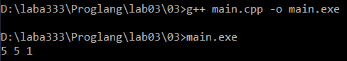
* В C++ программа компилируется, потому что язык допускает неявные преобразования int в double, char и bool.

* Тот же пример на Java:
`public class Main {`
`    public static void main(String[] args) {`
`        int a = 5;`
`        double b = a;`
`        char c = a;`
`        boolean d = a;`
`        System.out.println(b + " " + c + " " + d);`
`    }`
`}`
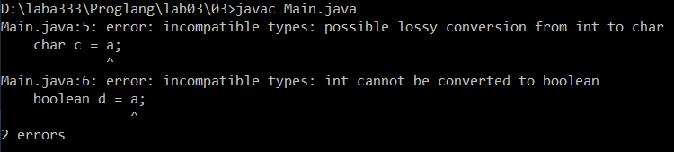
* В Java программа не компилируется: char c = a; и boolean d = a; вызывают ошибку согласования типов.
* Вывод: C++ – слабая статическая типизация, Java – сильная статическая типизация.

### Задание 4 **(1)**

*Рассмотрите следующий фрагмент программы.*

```
bool x = true, y = false;
auto a = x & y;
std::cout << typeid(a).name() << std::endl;
auto b = x && y;
std::cout << typeid(b).name() << std::endl;
```
*Используя* **typeid**, *найдите типы переменных* **a** и **b**. *Объясните результат.*

*Записанную программу сохраните в папке с номером задания.*

* Полный код программы:
`#include <iostream>`
`#include <typeinfo>`
`int main() {`
`    bool x = true, y = false;`
`    auto a = x & y;`
`    std::cout << typeid(a).name() << std::endl;`
`    auto b = x && y;`
`    std::cout << typeid(b).name() << std::endl;`
`}`
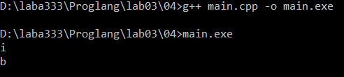
* Переменная a: оператор & (побитовое И) требует целого числа. bool неявно преобразуется к int: true - 1, false - 0. Результат: 1 & 0 = 0, тип a – int.
* Переменная b: оператор && (логическое И) работает с логическими значениями. Результат: true && false = false, тип b – bool.
* Программа выведет для a букву i (int), для b – букву b (bool).

### Задание 5 **(2)**
*Приведите разумные (логичные) примеры использования в С++ ключевых слов* **typedef, auto, decltype, static_cast** *и оператора* **sizeof**.

*Записанные программы сохраните в папке с номером задания. В отчет запишите пояснения к программам.*


* Пример typedef:
`#include <iostream>`
`typedef unsigned long long ull;`
`int main() {`
`    ull a = 10, b = 20;`
`    std::cout << a + b << std::endl;`
`}`
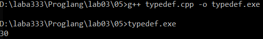
* typedef создаёт короткое имя ull для типа unsigned long long.

* Пример auto:
`#include <iostream>`
`int main() {`
`    auto x = 5;`
`    auto y = 3.14;`
`    auto s = "Hello";`
`    std::cout << x << " " << y << " " << s << std::endl;`
`}`
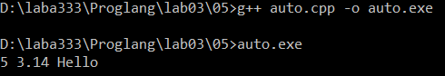
* auto определяет тип переменной по её инициализатору: x – int, y – double, s – const char*.

* Пример decltype:
`#include <iostream>`
`int main() {`
`    int a = 10;`
`    decltype(a) b = 20;`
`    std::cout << b << std::endl;`
`}`
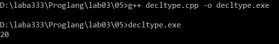
* decltype определяет тип переменной по выражению в скобках. Здесь b имеет тип int, как и a.

* Пример static_cast:
`#include <iostream>`
`int main() {`
`    double d = 3.99;`
`    int i = static_cast<int>(d);`
`    std::cout << i << std::endl;`
`}`
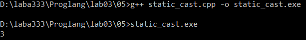
* static_cast выполняет явное преобразование типа на этапе трансляции. Дробная часть отсекается, i = 3.

* Пример sizeof:
`#include <iostream>`
`int main() {`
`    int a = 5;`
`    double b = 3.14;`
`    std::cout << sizeof(a) << " " << sizeof(b) << std::endl;`
`}`
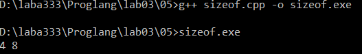
* sizeof возвращает размер переменной в байтах. Для int обычно 4, для double – 8.


### Задание 6 **(2)**

Рассмотрите следующий фрагмент программы. 
```
int a = -1, b = 1;
unsigned int c = 1;
std::cout << a*b << std::endl;
std::cout << a*c << std::endl;
```
* *Объясните работу этой программы, используя правила неявного преобразования типов*
* *Что произойдет, если тип* **int** *заменить на* **short**, а **unsigned int** на **unsigned short**?*


* Полный код программы:
`#include <iostream>`
`int main() {`
`    int a = -1, b = 1;`
`    unsigned int c = 1;`
`    std::cout << a * b << std::endl;`
`    std::cout << a * c << std::endl;`
`}`
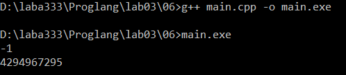
* a * b: оба операнда типа int, результат int: -1 * 1 = -1.
* a * c: один операнд int, другой unsigned int. По правилам неявного преобразования знаковый приводится к беззнаковому. -1 превращается в 2^32 - 1 = 4294967295. Результат: 4294967295 * 1 = 4294967295.

* Если заменить int на short, а unsigned int на unsigned short:
`#include <iostream>`
`int main() {`
`    short a = -1, b = 1;`
`    unsigned short c = 1;`
`    std::cout << a * b << std::endl;`
`    std::cout << a * c << std::endl;`
`}`
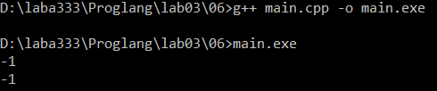
* a * b: оба операнда short, при арифметической операции приводятся к int. Результат: -1 * 1 = -1.
* a * c: short и unsigned short при арифметической операции сначала приводятся к int (потому что их размер меньше int). Поэтому -1 остаётся -1. Результат: -1 * 1 = -1.
* Обе строки выводят -1, потому что в обоих случаях типы приводятся к знаковому int.
* Вывод: для int + unsigned int знаковый приводится к беззнаковому, результат 4294967295. Для short + unsigned short оба приводятся к int, результат -1 и -1.


### Задание 7 **(2)**
*Рассмотрите следующий фрагмент программы.*
```
int x = 7, y = 4;
long double d = 0.25;
cout << (x / y) / d << endl;
cout << (x / d) / y << endl;
long a = 200000, b = 200000;
long long c = 200000;
std::cout << (a * b) * c << std::endl;
std::cout << a * (b * c) << std::endl;
```
*Почему изменения порядка действий приводит
к изменению результата? Объясните работу этой программы, используя правила неявного преобразования типов*


### Задание 8 **(2)**

*Для каких значений целочисленных переменных* **x**, **y** ,**z** *результатом
вычисления следующего выражения будет истина? Перечислите* **все** *случаи.
Объясните работу этой программы, используя правила неявного преобразования типов*

```
(x == y) + (x == z) == true
```

*Записанные программы сохраните в папке с номером задания.*


* В C++ результат сравнения приводится к int: true - 1, false - 0.
* Выражение превращается в: (x == y) + (x == z) == 1.
* Это верно, когда ровно одно из двух сравнений истинно.
* Случаи:
* x == y и x != z.
* x != y и x == z.

* Полный код программы:
`#include <iostream>`
`int main() {`
`    int x, y, z;`
`    std::cout << "Введите x, y, z: ";`
`    std::cin >> x >> y >> z;`
`    bool result = (x == y) + (x == z) == true;`
`    std::cout << result << std::endl;`
`}`

* Случай, когда оба сравнения ложны (результат 0):
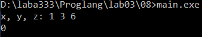
* Введены значения 1, 3, 6. x == y ложно (0), x == z ложно (0). Сумма 0. 0 == true ложно, результат 0.

* Случай, когда ровно одно сравнение истинно (результат 1):
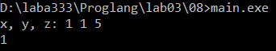
* Введены значения 1, 1, 5. x == y истинно (1), x == z ложно (0). Сумма 1. 1 == true истинно, результат 1.


### Задание 9 **(2)**

*Проверьте работу логического выражения*
```
x==y==z
```
*в языках* **Python**, **Java**, **C++** *для
целочисленных переменных* **x**, **y**, **z**.
*Объясните результат для каждого из языков.*

*Записанную программу сохраните в папке с номером задания.*


* Python:
`x = 1`
`y = 1`
`z = 1`
`print(x == y == z)`
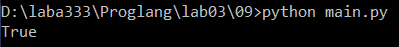
* Python использует цепочные сравнения. x == y == z означает (x == y) and (y == z). Для x=1, y=1, z=1: 1 == 1 дает True, 1 == 1 дает True. Результат: True.

* Java:
`public class Main {`
`    public static void main(String[] args) {`
`        int x = 1, y = 1, z = 1;`
`        System.out.println(x == y == z);`
`    }`
`}`
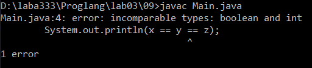
* Java: x == y возвращает boolean, а boolean нельзя сравнивать с int через ==. Компилятор выдает ошибку: incomparable types: boolean and int. Выражение не компилируется.

* C++:
`#include <iostream>`
`int main() {`
`    int x = 1, y = 1, z = 1;`
`    std::cout << (x == y == z) << std::endl;`
`}`
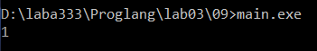
* C++: x == y возвращает int. Для x=1, y=1: x == y дает true, что преобразуется в 1. Затем 1 == z дает 1 == 1, что дает true, преобразуется в 1. Программа выводит 1.


### Задание 10 **(1))**

*Напишите программу на* **Python** *, демонстрирующую возможность неявного преобразования
строки в логическое значение.*

*Записанную программу сохраните в папке с номером задания.*


*Записанную программу сохраните в папке с номером задания.*

* Пример программы:
`s = input()`
`if s:`
`    print("Not empty")`
`else:`
`    print("Empty")`

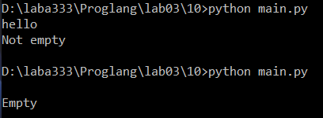

* В Python любая непустая строка приводится к True, пустая строка приводится к False.
* На скриншоте видно два запуска программы:
* Первый запуск: пользователь ввёл `hello`, программа вывела `Not empty`. Это значит, что строка `hello` не пустая, поэтому условие `if s:` истинно.
* Второй запуск: пользователь нажал Enter без ввода, программа вывела `Empty`. Это значит, что строка пустая, поэтому условие `if s:` ложно, и выполнился блок `else`.
* Вывод: Python неявно преобразует строку в логическое значение. Непустая строка дает True, пустая строка дает False.


